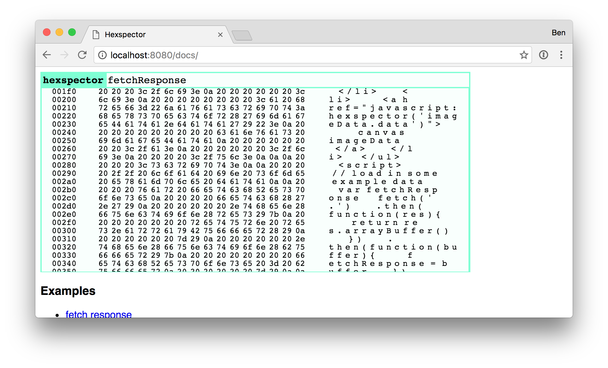

# hexspector

A tool for viewing hex dumps of buffers in your browser



## Usage

Include hexspector in your page

```html
<script src="https://unpkg.com/hexspector@1.0.0/"></script>
```

enter the typed array or array buffer you'd like to inspect

### TODO

* remove limit by selective rendering
* auto-reload on changes
* allow modifications
